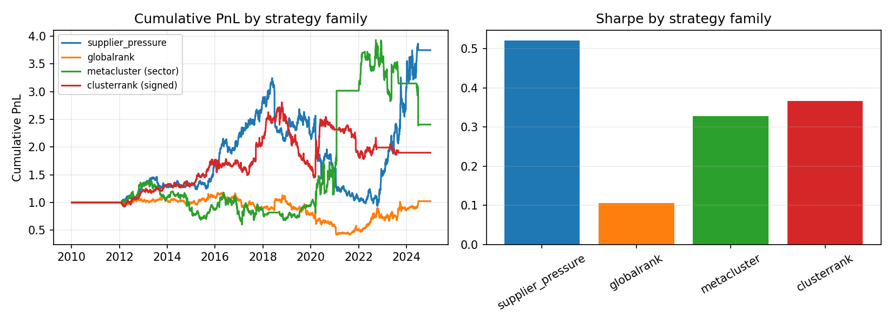
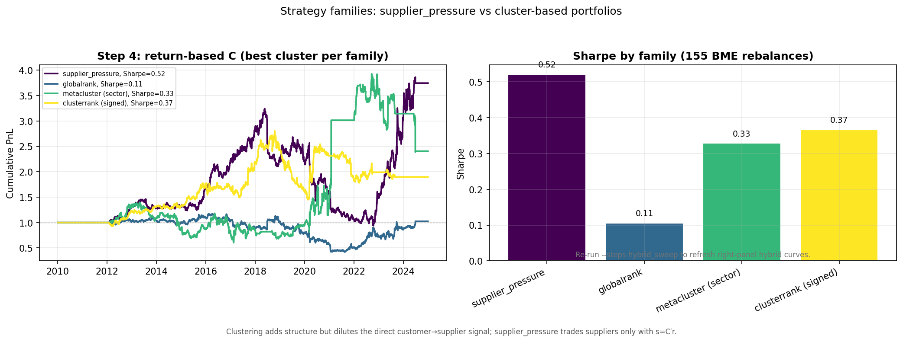
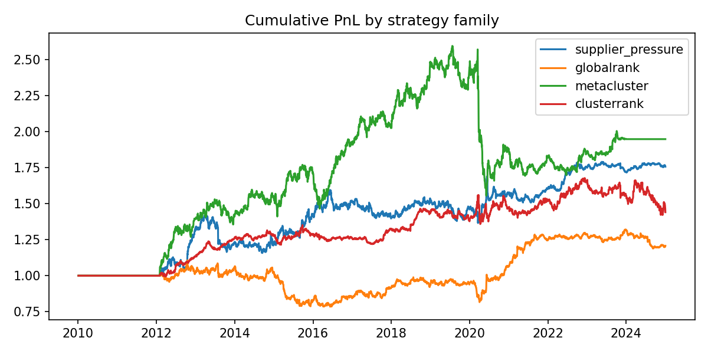
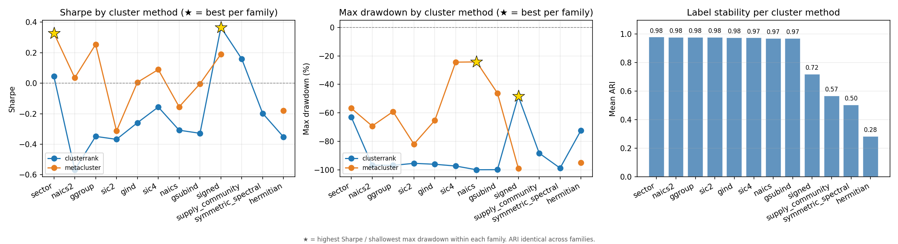
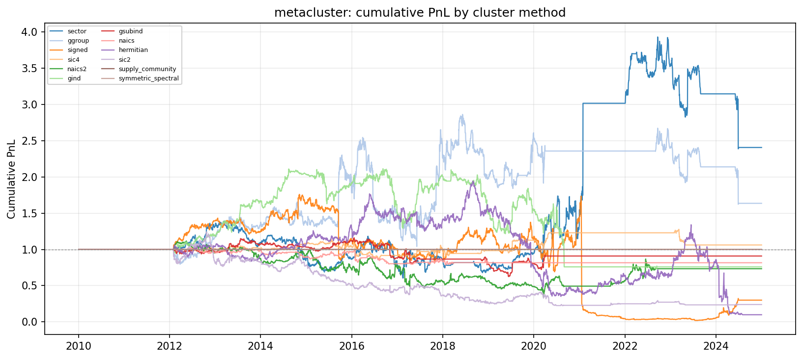
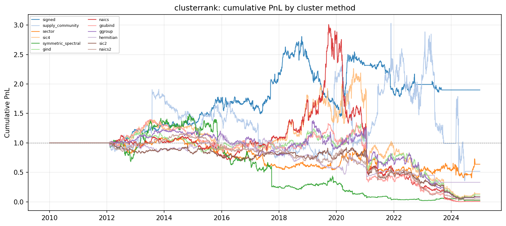
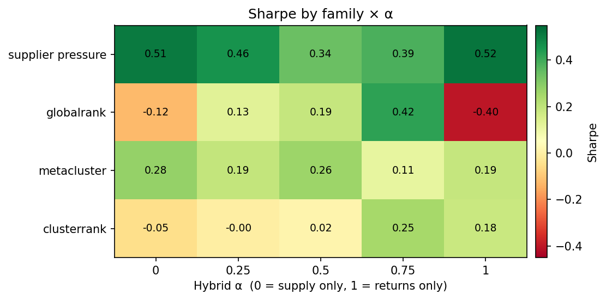
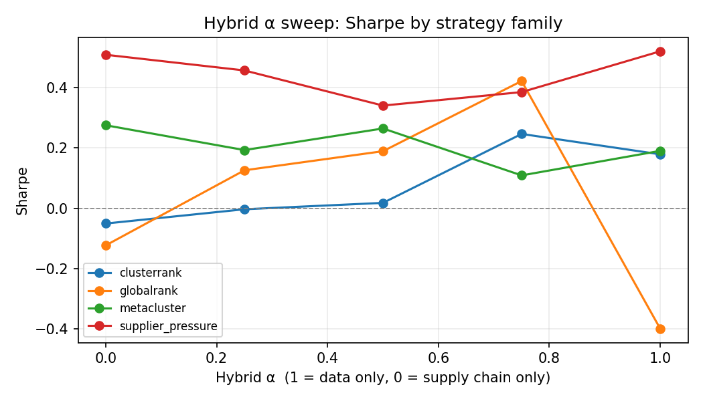
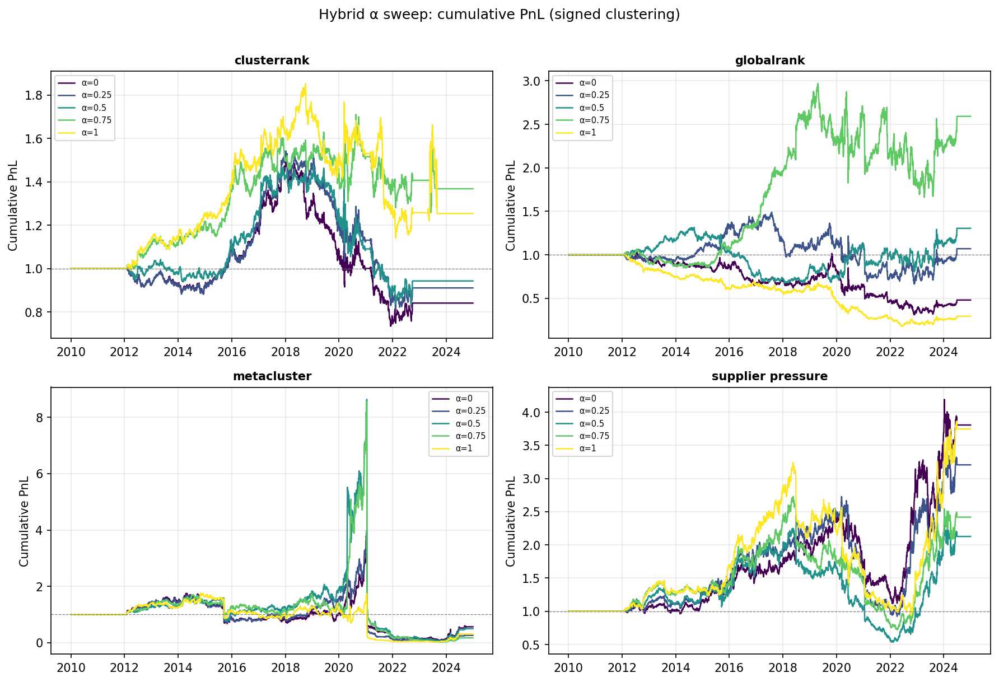

# Supply Chain Lead–Lag: Research Report (preliminary artifact set)

> **Deliverable status:** Preliminary results — backtest, clustering, and hybrid sweep are in good shape; panel FE/clustered SE, events, turnover/costs, and full rebalance calendar are **not** final. See [Appendix B](#appendix-b-submission-readiness-preliminary-vs-final).

## 1. Abstract
Point-in-time (PIT) supply-chain lead–lag study on Compustat customer–supplier links and daily returns (2010-01-04–2024-12-31). We compare four tradable families, sweep clustering methods, and blend \(C_{\text{data}}\) with \(C_{\text{supply}}\) via hybrid **α** (`signed` clusters; `tstat_diff`).

**Headline (defensible now):** Full **155-rebalance** PIT backtest. **Supplier pressure** is the best Sharpe baseline (0.52). **Metacluster (sector)** adds return with different path shape (corr ≈ 0 vs SP); **clusterrank (signed)** is best among cluster-rank specs after laggers-only fix (Sharpe 0.37). Cluster sweep: **sector** for meta, **signed** for clusterrank. Hybrid **α** on \(C\) still matters for **globalrank**. Panel FE, events, and net-of-cost claims remain open.

## 2. Research questions

Decisions use **conservative** labels when artifacts are pooled-OLS or capped at 12 rebalances.

                                           Research question                  Evidence file                                                                     Decision
            Does customer pressure predict supplier returns?      panel_forward_reverse.csv                               Preliminary yes; needs FE + clustered-SE rerun
                                  Is the effect directional?      panel_forward_reverse.csv  Inconclusive in this artifact; rerun reverse placebo with FE + clustered SE
                                     Is the effect tradable?            summary_metrics.csv                                                              Preliminary yes
                   Does higher-order network structure help? strategy_family_comparison.csv Preliminary yes (extensions add return; supplier_pressure still best Sharpe)
                       Does direction-aware clustering help?  cluster_method_comparison.csv                                                          Yes for sector/meta
Does supply-chain structure stabilize return-based lead-lag?         hybrid_alpha_sweep.csv                                                              Preliminary yes
                               Is diffusion event-amplified? event_conditioned_backtest.csv                                                                      Not run

## 3. Data and PIT construction
- Returns: `data/returns_with_gvkey.parquet` · Edges: `data/merged_edges.csv`
- PIT date column: `filing_date` · Rebalance: `BME`
- Window: 2010-01-04–2024-12-31 · 155 rebalances · 5461 return assets · 17153 PIT edge rows
- Step 4 cluster map: `{'metacluster': 'sector', 'clusterrank': 'signed'}`
- Pipeline steps in last run: `families, load`

## 4. Customer-pressure signal
At each day \(d\), signal \(s = C^\top r_d\) (customer pressure on suppliers); long–short **suppliers only** with return earned on \(d+1\) (`supplier_pressure` family).

Rolling backtest (signed cluster label for bookkeeping, no clustering in signal): Sharpe **0.52**, ann. return 11.1%, max DD -71.1%.

## 5. Panel predictability results
**Panel quality warning:** This run used `none_pooled` with `clustered_se=False` and missing `std_error` / `p_value` on some rows. Rebuild `data/leadlag_panel_forward.parquet` and `data/leadlag_panel_reverse.parquet` (`scripts/build_leadlag_panel.py`), install `linearmodels`, then rerun `--steps load,panel` for firm + time FE and entity-clustered standard errors.

                   direction  horizon      beta  std_error    t_stat  p_value    n_obs  n_entities fixed_effects  clustered_se condition
forward_customer_to_supplier        1  0.041264        NaN  7.907461      NaN 633674.0         460   none_pooled         False  all_days
forward_customer_to_supplier        2  0.038797        NaN  7.434801      NaN 633599.0         460   none_pooled         False  all_days
forward_customer_to_supplier        3 -0.012025        NaN -2.304075      NaN 633604.0         461   none_pooled         False  all_days
forward_customer_to_supplier        4 -0.004167        NaN -0.798383      NaN 633530.0         461   none_pooled         False  all_days
forward_customer_to_supplier        5  0.000701        NaN  0.134268      NaN 633454.0         461   none_pooled         False  all_days

Forward horizon 1 shows positive pooled β with large |t|, but **reverse horizons 1–2 also have |t| > 2** in this artifact — directionality is **not** established until FE + clustered SE. Do not cite this table as final regression evidence.

## 6. Directional reverse placebo

**Forward:**

                   direction  horizon      beta  std_error    t_stat  p_value    n_obs  n_entities fixed_effects  clustered_se condition
forward_customer_to_supplier        1  0.041264        NaN  7.907461      NaN 633674.0         460   none_pooled         False  all_days
forward_customer_to_supplier        2  0.038797        NaN  7.434801      NaN 633599.0         460   none_pooled         False  all_days
forward_customer_to_supplier        3 -0.012025        NaN -2.304075      NaN 633604.0         461   none_pooled         False  all_days
forward_customer_to_supplier        4 -0.004167        NaN -0.798383      NaN 633530.0         461   none_pooled         False  all_days
forward_customer_to_supplier        5  0.000701        NaN  0.134268      NaN 633454.0         461   none_pooled         False  all_days

**Reverse:**

                   direction  horizon      beta  std_error    t_stat  p_value    n_obs  n_entities fixed_effects  clustered_se condition
reverse_supplier_to_customer        1  0.008175        NaN  2.548883      NaN 633563.0         460   none_pooled         False  all_days
reverse_supplier_to_customer        2  0.008087        NaN  2.520901      NaN 633375.0         460   none_pooled         False  all_days
reverse_supplier_to_customer        3 -0.005523        NaN -1.721166      NaN 633187.0         460   none_pooled         False  all_days
reverse_supplier_to_customer        4 -0.003465        NaN -1.079393      NaN 632998.0         460   none_pooled         False  all_days
reverse_supplier_to_customer        5 -0.008932        NaN -2.781741      NaN 632809.0         460   none_pooled         False  all_days

**Read with caution:** Reverse placebo is not cleanly insignificant under pooled OLS (e.g. reverse h=1,2 with |t|≈2.5; h=5 with |t|≈−2.8). Rerun with PanelOLS on built panel parquets.

## 7. Lead-lag matrix construction
Rolling \(C\), lookback 504 rows, score `tstat_diff`.

## 8. Network structure and spectral diagnostics
*Optional — run `artifacts` step.*

## 9. Strategy family comparison
**Interpretation (Step 4, return-based \(C\), 155 BME rebalances):**
- **Configuration:** `metacluster` uses **sector** clustering; `clusterrank` uses **signed**; `supplier_pressure` / `globalrank` do not partition by cluster.
- **Supplier pressure** (Sharpe **0.52**, max DD -71.1%): best risk-adjusted baseline; trades **suppliers only** with \(s=C^\top r\).
- **Metacluster (sector)** (Sharpe **0.33**, max DD -56.8%): strong cumulative return but **higher vol** and episodic (sector meta-flow spike ~2021–22, give-back after); not a clean substitute for supplier pressure.
- **Clusterrank (signed)** (Sharpe **0.37**, max DD -48.3%): improved after **laggers-only** fix (see §9.1); still below supplier pressure on Sharpe.
- **Globalrank** (Sharpe **0.11**): static spectral rank on full network; weakest family.
- Cluster-based families **dilute** the direct customer→supplier signal; beating supplier pressure on Sharpe is **not** expected for structural extensions.

  strategy_family cluster_method edge_score  ann_return  ann_vol   sharpe  max_drawdown  avg_turnover  net_sharpe  n_traded_assets_avg  notes
supplier_pressure         signed tstat_diff    0.111417 0.213785 0.521166     -0.710557           NaN    0.521166                  NaN    NaN
      clusterrank         signed tstat_diff    0.053263 0.145470 0.366141     -0.483454           NaN    0.366141                  NaN    NaN
      metacluster         sector tstat_diff    0.113467 0.345592 0.328328     -0.567501           NaN    0.328328                  NaN    NaN
       globalrank         signed tstat_diff    0.020282 0.192481 0.105370     -0.643095           NaN    0.105370                  NaN    NaN

### 9.1 Strategy-family diversification (portfolio of methods)

This is **not** hybrid **α** on \(C\) (see §11); it is combining **finished family return series**.

**Daily return correlation (full sample):**

           family  supplier_pressure  metacluster  clusterrank  globalrank
supplier_pressure              1.000        0.008       -0.042       0.093
      metacluster              0.008        1.000        0.025       0.022
      clusterrank             -0.042        0.025        1.000      -0.059
       globalrank              0.093        0.022       -0.059       1.000

- **Supplier pressure vs metacluster:** correlation **0.008** on average — mostly **orthogonal**, despite **opposite-looking** cumulative paths in some subperiods (episodic sector meta-flow vs supplier drawdown/recovery timing).
- **50/50 supplier_pressure + metacluster:** Sharpe **0.55** (vs 0.52 supplier-only, 0.33 metacluster-only).
- **Equal-weight all four families:** Sharpe **0.62** (in-sample; not OOS-validated).

**Takeaway:** A **modest ensemble** of methods may improve risk-adjusted return via diversification; treat as exploratory. Re-run `hybrid_sweep` with per-family `family_cluster_methods` for α tuning on \(C\).

## 10. Clustering method comparison
**Interpretation (155 rebalances; `hybrid_prior` excluded — same role as hybrid α on \(C\)):**
- Best single cell: **clusterrank / signed** (Sharpe 0.37).
- **Step 4 defaults:** **metacluster → sector**, **clusterrank → signed** (from sweep; clusterrank re-sweep uses fixed laggers-only implementation).
- **Industry labels** (sector, ggroup, …): ARI ≈ 0.97–0.98 (static GICS maps). **Network labels** (signed, hermitian, …): ARI ≈ 0.28–0.72 (dynamic partitions).
- **Metacluster:** `supply_community` / `symmetric_spectral` often produce **no trades** (flat PnL).
- Metacluster / **sector**: Sharpe 0.33 (recommended).
- Clusterrank / **signed**: Sharpe 0.37 (recommended after fix).
- Clusterrank runner-up: **supply_community** (Sharpe 0.16).

strategy_family   cluster_method  n_clusters edge_score  hybrid_alpha  ann_return  ann_vol    sharpe  max_drawdown  avg_turnover  cluster_ari_mean  eigenspace_drift_mean  n_rebalances
    clusterrank           signed          10 tstat_diff           NaN    0.053263 0.145470  0.366141     -0.483454           NaN          0.719605               1.318381           155
    metacluster           sector          10 tstat_diff           NaN    0.113467 0.345592  0.328328     -0.567501           NaN          0.979296               1.318381           155
    metacluster           ggroup          10 tstat_diff           NaN    0.070207 0.275737  0.254618     -0.591064           NaN          0.978325               1.318381           155
    metacluster           signed          10 tstat_diff           NaN    0.097077 0.509686  0.190465     -0.988833           NaN          0.719605               1.318381           155
    clusterrank supply_community          10 tstat_diff           NaN    0.079614 0.500881  0.158949     -0.882603           NaN          0.566851               1.318381           155
    metacluster             sic4          10 tstat_diff           NaN    0.008274 0.092477  0.089471     -0.244145           NaN          0.974131               1.318381           155
    clusterrank           sector          10 tstat_diff           NaN    0.012883 0.287526  0.044807     -0.629773           NaN          0.979296               1.318381           155
    metacluster           naics2          10 tstat_diff           NaN    0.008621 0.242490  0.035552     -0.692038           NaN          0.978731               1.318381           155
    metacluster             gind          10 tstat_diff           NaN    0.001144 0.193621  0.005907     -0.652884           NaN          0.975198               1.318381           155
    metacluster          gsubind          10 tstat_diff           NaN   -0.000371 0.109417 -0.003391     -0.461297           NaN          0.969967               1.318381           155
    metacluster            naics          10 tstat_diff           NaN   -0.010988 0.070877 -0.155025     -0.242332           NaN          0.969991               1.318381           155
    clusterrank             sic4          10 tstat_diff           NaN   -0.057048 0.365181 -0.156218     -0.972817           NaN          0.974131               1.318381           155

## 11. Hybrid alpha sweep
**Interpretation (signed clustering, full sample):**
- **α = 0** uses only the normalized supply-chain adjacency; **α = 1** uses only return-estimated \(C_{\text{data}}\).
- **supplier pressure:** best Sharpe at **α = 1** (Sharpe 0.52, max DD -0.71).
- **globalrank:** best Sharpe at **α = 0.75** (Sharpe 0.42, max DD -0.44).
- **metacluster:** best Sharpe at **α = 0** (Sharpe 0.28, max DD -0.98).
- **clusterrank:** best Sharpe at **α = 0.75** (Sharpe 0.25, max DD -0.26).
- **Supplier pressure** is strong across α (supply prior ≈ returns-only); **globalrank** is highly α-sensitive (best at α = 0.75, weak at α ∈ {0, 1}).
- **Metacluster** shows high in-sample Sharpe at low α but **~99% drawdown** in cumulative PnL (2020–21 spike/crash); treat as unstable despite positive Sharpe.
- **Clusterrank** improves with more data weight (α = 0.75–1.0) vs pure supply (α = 0).

See `plots/methods_comparison.png` (α = 1 vs best-α) and `plots/hybrid_sharpe_heatmap.png`.

**Best α per family:**

  strategy_family  alpha   sharpe  ann_return  max_drawdown
supplier_pressure   1.00 0.521166    0.111417     -0.710557
       globalrank   0.75 0.422398    0.083280     -0.440753
      metacluster   0.00 0.275460    0.149869     -0.981191
      clusterrank   0.75 0.246663    0.026877     -0.264412

**Full grid:**

 alpha   strategy_family cluster_method edge_score  ann_return  ann_vol    sharpe  max_drawdown  avg_turnover  net_sharpe  hit_rate    calmar  avg_daily_return  n_days  cluster_ari_mean  eigenspace_drift_mean
  0.00       clusterrank         signed tstat_diff   -0.005553 0.109077 -0.050908     -0.508830           NaN   -0.050908  0.339428 -0.010913         -0.000022    3774          0.742510               0.658475
  0.25       clusterrank         signed tstat_diff   -0.000375 0.107771 -0.003479     -0.473718           NaN   -0.003479  0.340223 -0.000792         -0.000001    3774          0.742510               0.974374
  0.50       clusterrank         signed tstat_diff    0.001902 0.107445  0.017702     -0.434711           NaN    0.017702  0.335188  0.004375          0.000008    3774          0.740793               1.168470
  0.75       clusterrank         signed tstat_diff    0.026877 0.108961  0.246663     -0.264412           NaN    0.246663  0.350026  0.101647          0.000107    3774          0.719363               1.229595
  1.00       clusterrank         signed tstat_diff    0.023690 0.132406  0.178922     -0.384330           NaN    0.178922  0.358506  0.061641          0.000094    3774          0.719605               1.291126
  0.00        globalrank         signed tstat_diff   -0.026356 0.213705 -0.123328     -0.698418           NaN   -0.123328  0.383148 -0.037736         -0.000105    3774          0.742510               0.658475
  0.25        globalrank         signed tstat_diff    0.026130 0.207518  0.125919     -0.553925           NaN    0.125919  0.398516  0.047173          0.000104    3774          0.742510               0.974374
  0.50        globalrank         signed tstat_diff    0.034004 0.179572  0.189361     -0.488843           NaN    0.189361  0.401961  0.069560          0.000135    3774          0.740793               1.168470
  0.75        globalrank         signed tstat_diff    0.083280 0.197161  0.422398     -0.440753           NaN    0.422398  0.409645  0.188950          0.000330    3774          0.719363               1.229595
  1.00        globalrank         signed tstat_diff   -0.067516 0.168676 -0.400271     -0.823270           NaN   -0.400271  0.384473 -0.082010         -0.000268    3774          0.719605               1.291126
  0.00       metacluster         signed tstat_diff    0.149869 0.544068  0.275460     -0.981191           NaN    0.275460  0.402226  0.152742          0.000595    3774          0.742510               0.658475
  0.25       metacluster         signed tstat_diff    0.105709 0.547600  0.193041     -0.991651           NaN    0.193041  0.404081  0.106599          0.000419    3774          0.742510               0.974374
  0.50       metacluster         signed tstat_diff    0.142771 0.539081  0.264842     -0.993945           NaN    0.264842  0.403021  0.143641          0.000567    3774          0.740793               1.168470
  0.75       metacluster         signed tstat_diff    0.055902 0.513041  0.108961     -0.998037           NaN    0.108961  0.397986  0.056012          0.000222    3774          0.719363               1.229595
  1.00       metacluster         signed tstat_diff    0.097077 0.509686  0.190465     -0.988833           NaN    0.190465  0.415739  0.098174          0.000385    3774          0.719605               1.291126
  0.00 supplier_pressure         signed tstat_diff    0.114496 0.224661  0.509641     -0.580705           NaN    0.509641  0.399046  0.197168          0.000454    3774          0.742510               0.658475
  0.25 supplier_pressure         signed tstat_diff    0.103483 0.226159  0.457567     -0.661069           NaN    0.457567  0.405935  0.156539          0.000411    3774          0.742510               0.974374
  0.50 supplier_pressure         signed tstat_diff    0.075190 0.220584  0.340869     -0.761728           NaN    0.340869  0.396926  0.098710          0.000298    3774          0.740793               1.168470
  0.75 supplier_pressure         signed tstat_diff    0.081823 0.212156  0.385671     -0.736043           NaN    0.385671  0.397191  0.111165          0.000325    3774          0.719363               1.229595
  1.00 supplier_pressure         signed tstat_diff    0.111417 0.213785  0.521166     -0.710557           NaN    0.521166  0.408850  0.156803          0.000442    3774          0.719605               1.291126

## 12. Event-conditioned diffusion
*Optional — run `events` step.*

## 13. Transaction costs and risk controls
  strategy_family cluster_method edge_score  hybrid_alpha baseline_type  ann_return  ann_vol   sharpe  max_drawdown  net_sharpe  calmar  hit_rate  avg_daily_return  avg_turnover  gross_sharpe  total_cost_bps  n_days  n_rebalances
supplier_pressure         signed tstat_diff           NaN          main    0.041367 0.085974 0.481159     -0.183721    0.481159     NaN       NaN               NaN           NaN      0.481159             0.0    3774            12
       globalrank         signed tstat_diff           NaN          main    0.015893 0.080985 0.196249     -0.291659    0.196249     NaN       NaN               NaN           NaN      0.196249             0.0    3774            12
      metacluster         signed tstat_diff           NaN          main    0.050019 0.104267 0.479720     -0.400615    0.479720     NaN       NaN               NaN           NaN      0.479720             0.0    3774            12
      clusterrank         signed tstat_diff           NaN          main    0.026855 0.070053 0.383356     -0.152914    0.383356     NaN       NaN               NaN           NaN      0.383356             0.0    3774            12

**Not final for trading claims:** `avg_turnover` is NaN and `total_cost_bps` is 0 — gross Sharpe equals net Sharpe. Populate turnover/cost assumptions before submission.

## 14. Implementation notes
- **Clusterrank (fixed):** Prior versions shorted **local leaders** instead of long–short **among laggers only** (IMPLEMENTATION_SPEC §6). Step 4 and clusterrank-only `cluster_sweep` reruns use the corrected rule.
- **Cluster sweep:** `hybrid_prior` removed from method comparison (duplicates hybrid α on \(C\)). Partial rerun: `--cluster-sweep-families clusterrank` merges into existing CSVs.
- **Globalrank:** Static weights per rebalance window (spec §4); no daily signal refresh.

## 15. Limitations
- **Panel:** `panel_forward_reverse.csv` is pooled OLS without clustered SE — not final for RQ1–2.
- **Hybrid α sweep:** May predate latest `family_cluster_methods`; rerun `--steps hybrid_sweep` to align.
- **Metacluster:** Episodic PnL (sector labels + meta-flow) — report path risk, not Sharpe alone.
- **Events / costs:** `event_conditioned_*.csv` and turnover in `summary_metrics.csv` incomplete.
- **Ensemble Sharpe:** In-sample combinations (§9.1) are exploratory, not OOS-validated.

## 16. Conclusion
Under **155 BME rebalances** (2010–2024) and PIT supply-chain edges:

1. **Supplier pressure** remains the primary tradable story (Sharpe ~0.52) — direct \(C^\top r\) on suppliers.
2. **Metacluster (sector)** is the best cluster extension for meta-flow (Sharpe ~0.33) but with different crisis behavior than supplier pressure; low return correlation suggests **ensemble** potential, not redundancy.
3. **Clusterrank (signed)** is the best network cluster-rank spec after the laggers-only fix (Sharpe ~0.37).
4. **Globalrank** underperforms; hybrid **α** tuning helps globalrank (best α ≈ 0.75 in prior sweep).
5. Regression directionality, events, and net-of-cost robustness are **not** final — see Appendix B.

- **supplier_pressure** (`signed`): Sharpe 0.52, max DD -71.1%
- **metacluster** (`sector`): Sharpe 0.33, max DD -56.8%
- **clusterrank** (`signed`): Sharpe 0.37, max DD -48.3%
- **globalrank** (`signed`): Sharpe 0.11, max DD -64.3%

**Hybrid α on \(C\) (prior sweep; refresh recommended):** `supplier_pressure` @ α=1 (Sharpe 0.52), `globalrank` @ α=0.75 (Sharpe 0.42), `metacluster` @ α=0 (Sharpe 0.28), `clusterrank` @ α=0.75 (Sharpe 0.25).

## Appendix A: artifact checklist

**Plots:**
- `plots/cluster_sweep_cumulative_pnl_clusterrank.png`
- `plots/cluster_sweep_cumulative_pnl_metacluster.png`
- `plots/cluster_sweep_dashboard.png`
- `plots/cumulative_pnl_by_strategy.png`
- `plots/drawdown_by_strategy.png`
- `plots/hybrid_alpha_sweep.png`
- `plots/hybrid_alpha_sweep_cumulative_pnl.png`
- `plots/methods_comparison.png`
- `plots/strategy_families_dashboard.png`

**Required CSVs (EXPECTED_OUTPUTS §8):**
- ✓ `summary_metrics.csv`
- ✓ `panel_forward_reverse.csv`
- ✓ `strategy_family_comparison.csv`
- ✓ `cluster_method_comparison.csv`
- ✓ `hybrid_alpha_sweep.csv`
- ✓ `cluster_stability.csv`

## Appendix B: Submission readiness (preliminary vs final)

**Status:** This directory is a **preliminary results** bundle (backtest, clustering, hybrid). It is sufficient for pipeline validation and exploratory comparison; it is **not** a complete final research deliverable until the ⚠ / ✗ items below are addressed.

**Defensible headline:** Full **155-rebalance** run. **Supplier pressure** best Sharpe (~0.52); **metacluster/sector** and **clusterrank/signed** are best cluster choices; families are largely uncorrelated (SP vs meta ≈ 0). Clusterrank implementation fixed (laggers-only). Panel FE, events, costs, and refreshed hybrid α sweep still needed for final submission.

| File | Status |
|------|--------|
| `summary_metrics.csv` | ⚠ turnover/costs incomplete |
| `strategy_family_comparison.csv` | ✓ present |
| `cluster_method_comparison.csv` | ✓ present |
| `hybrid_alpha_sweep.csv` | ✓ present |
| `cluster_stability.csv` | ✓ present |
| `panel_forward_reverse.csv` | ⚠ pooled OLS fallback; NaN SE/p-values |
| `horizon_decay.csv` | ✓ present |
| `event_conditioned_backtest.csv` | ✗ missing (run events step) |
| `turnover_costs.csv` | ✗ missing |
| `factor_exposure_alpha.csv` | ✗ optional |

**Recommended reruns:** (1) `build_leadlag_panel.py` + `--steps load,panel` with `linearmodels`; (2) `--steps events` with earnings calendar; (3) full rebalance calendar (drop or raise `--max-rebalances` cap); (4) populate turnover/cost columns in `summary_metrics.csv`.
